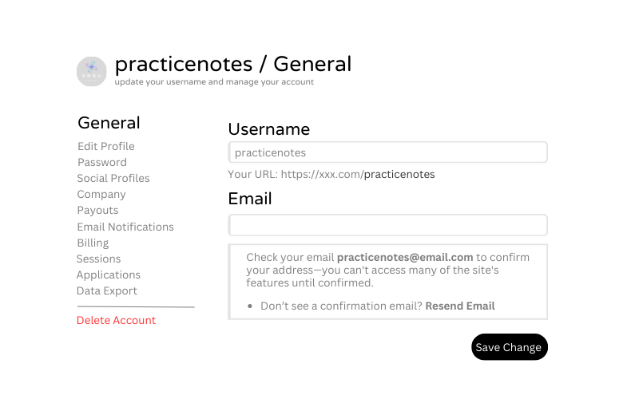

# uiuxpg

UI/UX Playground (uiuxpg)

## 项目简介
该项目是一个用于 UI 和 UX 前端设计的练习，记录practicenotes007个人利用设计工具进行创意实践和设计测试的试验场。

## 练习题 ：DailyUI#7 Settings - 2024.11.10

**题目要求**

Prompt: Settings

Design settings for something. Is it for security or privacy settings? Game settings? Light mode vs. dark mode? System settings (sound, notifications, screen time, Wi-Fi, etc.?) 
 
What is it and what are the most important settings? 

Share your design on Dribbble or Twitter with #[DailyUI](https://www.dailyui.co/)

**UI设计草图**

[查看原始设计](https://www.canva.com/design/DAGWCHkLXOI/VVicRJkJvyFUd0uxC90DyQ/edit?utm_content=DAGWCHkLXOI&utm_campaign=designshare&utm_medium=link2&utm_source=sharebutton)

## 设计工具
- [DailyUI](https://www.dailyui.co/)
- [canva.com](https://www.canva.com)
- [Dribbble.com](https://www.dribbble.com)

## 联系方式

如有任何问题或建议，请联系我：

- 邮箱: practicenotes@163.com
- GitHub: [practicenotes007](https://github.com/practicenotes007)